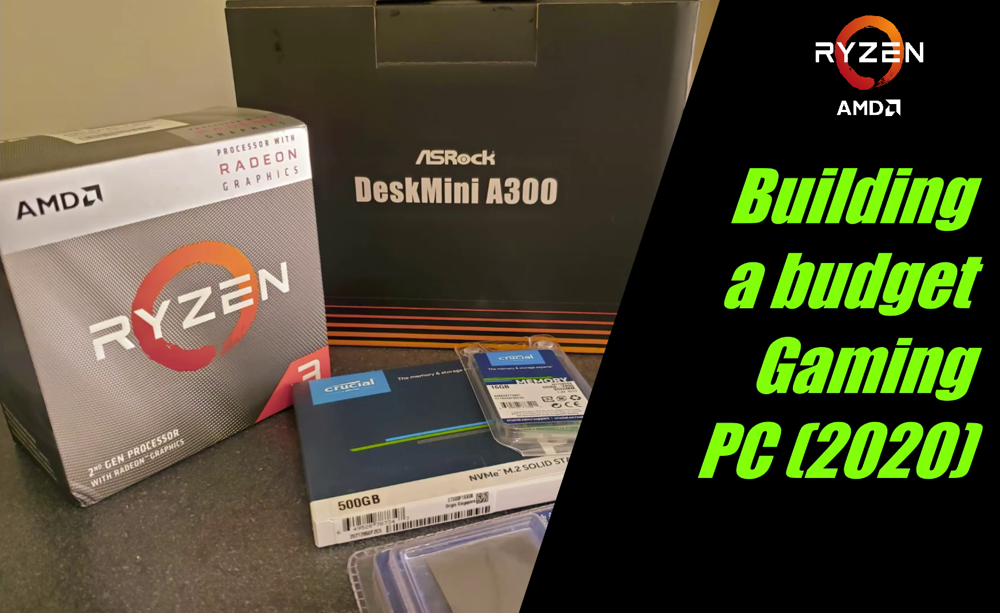

# Team RED!

I am considering this a personal project. By the way, my first time building a PC (actually a Mini-PC). Before this, I always used OEM laptop and this project was all about how I can make the most epic PC for less money while reusing existing components from old laptops. In my case, i used RAM, HDD from my previous laptop, and Google Home-Mini which for lying around for speakers.

The whole concept is, $ave that Money :wink:

---

# Motivation:
You may think, why now? Why AMD?
There are many reasons, few of them are
 
- Working from home: more tabs + more programs, I needed a better processor than my 2 Core i7-6600U from Q3'15.
- Needed something with Graphics to edit videos 
- But the major component of motivation was **Henry Cavil**:muscle:. I am a huge fan of him, and after watching his PC building <a href="https://jamonline.ph/tech-news/watch-henry-cavill-seductively-build-a-300k-gaming-pc//"> video</a>, I then and there decided even I want to build a PC NOW!! ....and the search for the parts began 

  </a>

---

# Making a List:

I needed a CPU, CPU Cooler, a Motherboard which can use a **SODIMM** memory, SSD, Graphic Card, and a case.
I already had Monitors, 1x8GB RAM, 1x500GB HDD, speakers, and 14TB external hard drive.
I started looking for a case and to my surprise, there are a lot! From NZXT, Corsair, Cooler Master. So to make it simple, I started looking for **Mini-PC builds**:eyes:

---

# Finding the One:

There is a handful of Mimi-PC, but I was mainly looking for a **Barebones** system, with no CPU, SSD, and RAM, also known as a **Small form-factor** (SFF).
Top names are Intel NUC, Lenovo ThinkCentre, HP Mini Workstations, but as I said earlier, i ditched Intel and wanted a cheap yet powerful system. But where could I find it? 🤔

*Drum roll*🥁 

### AMD APUs!

---

# Ryzen Shine:

Once I made my mind for AMD, I shortlisted listed two of the manufacturers which I liked.

 - <a href="https://www.indiegogo.com/projects/the-next-gen-minis-amd-yes#/"> Minisforum - DMAF5 </a>
 - <a href="https://asrock.com/nettop/AMD/DeskMini%20A300%20Series/"> ASRock DeskMini A300W </a>

#### Minisforum - DMAF5 Story:
I found about them from my Google Feeds (thanks Google lady:+1:). I watched a few videos, researched for hours on the company's background, and whether I should buy it or not. I found out that they are a promising company, and their product is solid. I joined their FB group asked a few questions which I had, they are kind, supportive, and fast in replying to people querries.

But the only thing that made me not choose Minisforum was- **TIME**, so the thing is that they have launched a funding campaign on Indiegogo and it will take them 2-3 months to ships the final product to the users worldwide. And I wanted my PC in a few weeks, I did not have that much patience so I moved forward with **ASRock**, also they don't have an option for barebones 

  </a>

#### Minisforum - DMAF5 Specs:

  </a>

